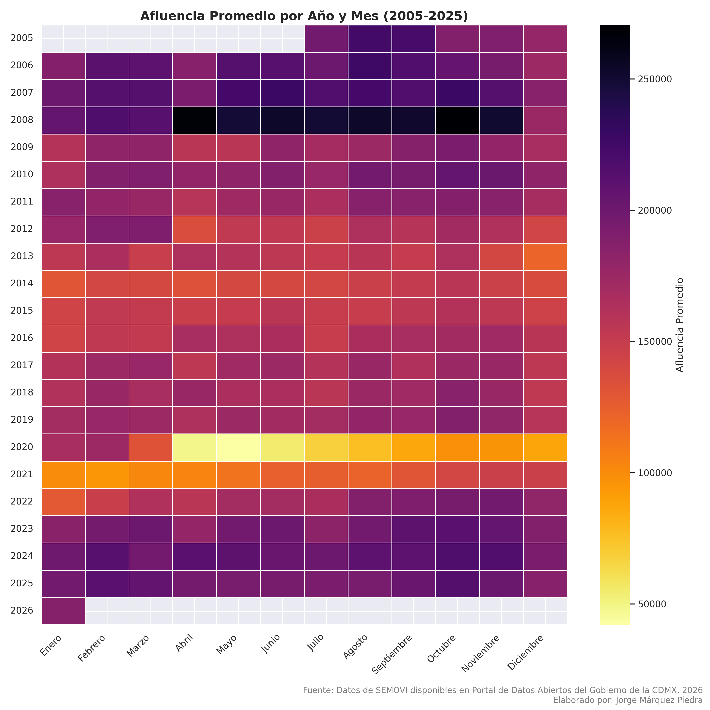
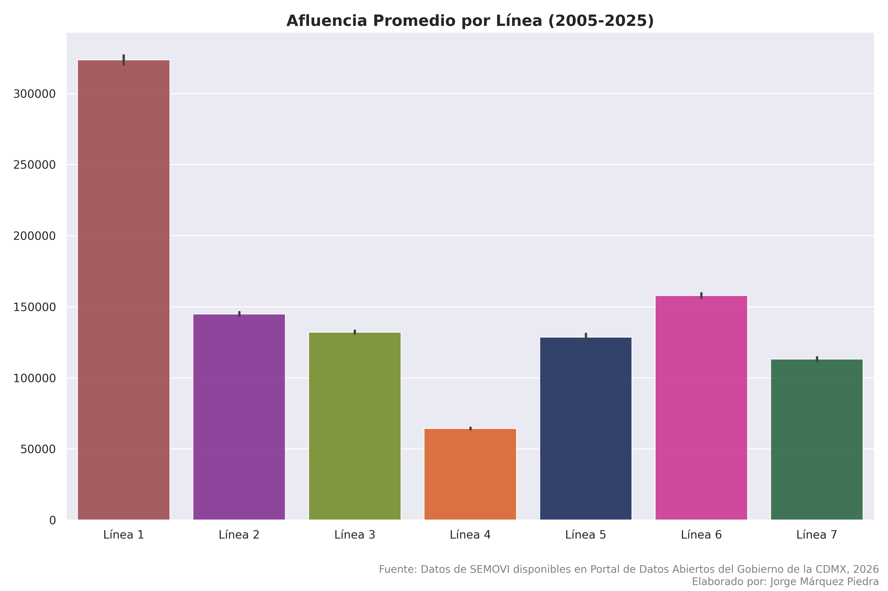
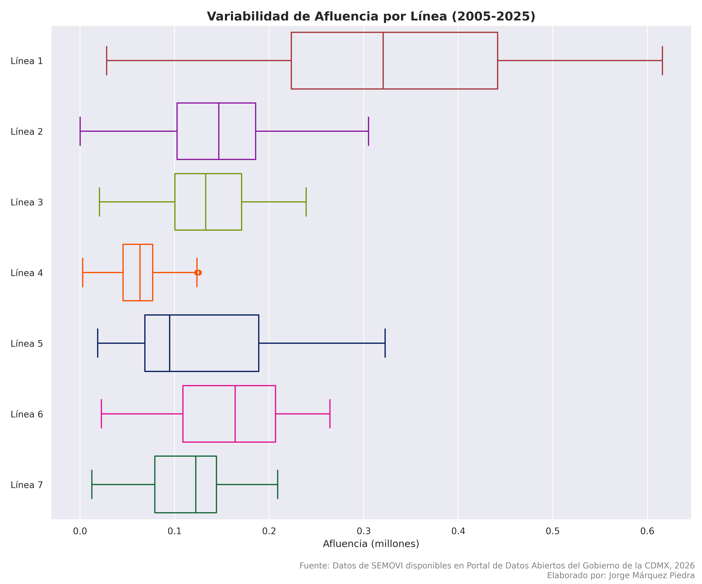
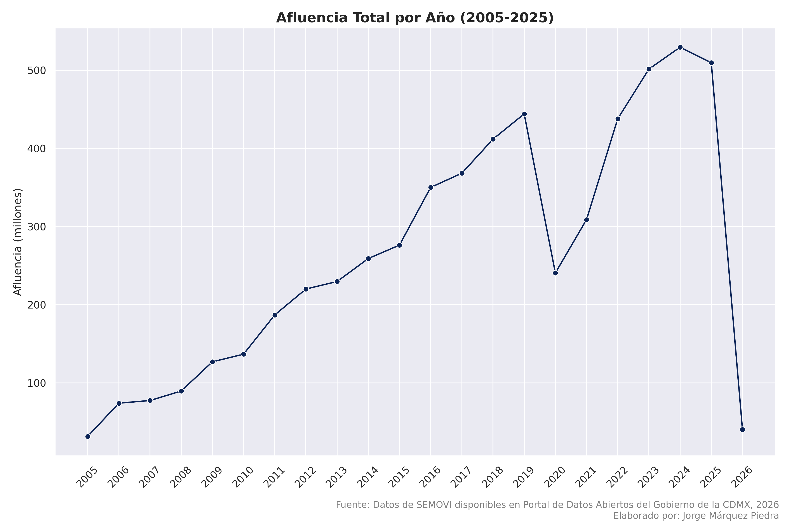
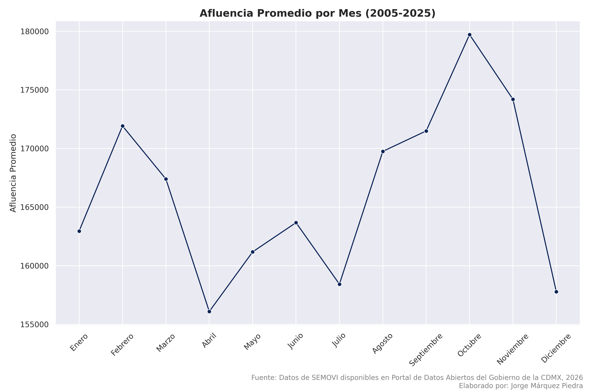
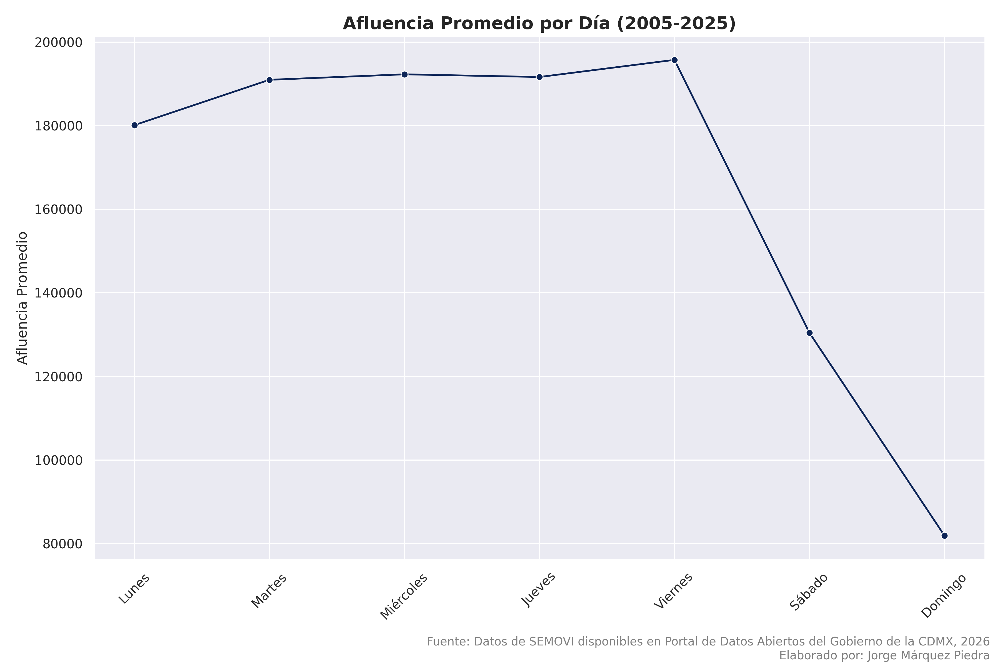
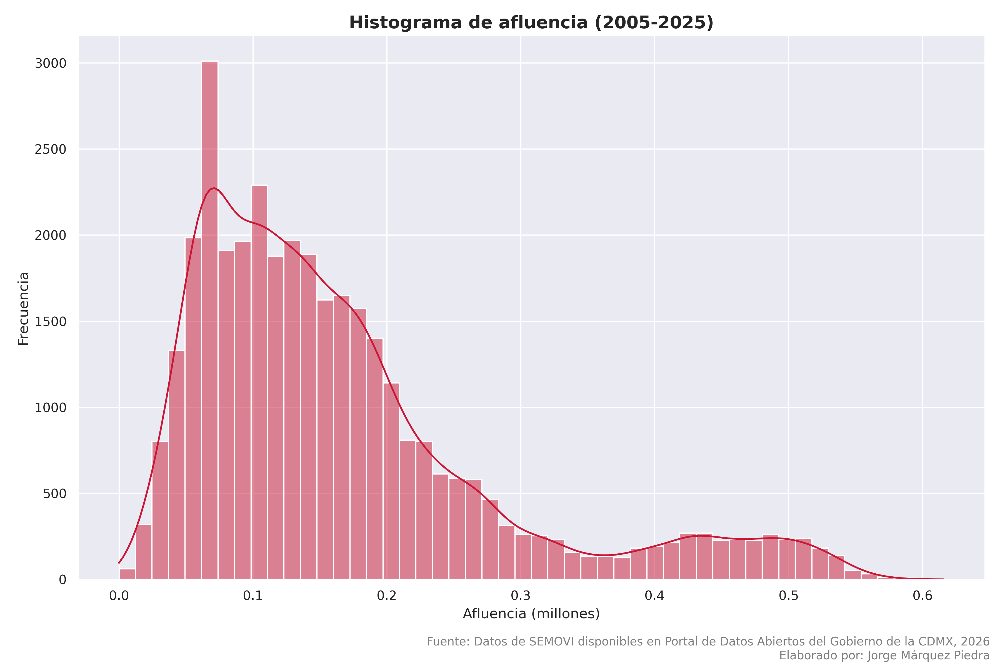

# Afluencia-Metrobus-Ciudad-de-Mexico-2010-a-2025-Python

**Lenguaje: Python 3.x**

**Librerías: Pandas, Matplotlib, Seaborn, NumPy**

**Entorno: Google Colab / Jupyter Notebook**

## Este proyecto realiza un análisis exploratorio de datos (EDA) sobre la afluencia de pasajeros en el Metrobus de la Ciudad de México. El objetivo es identificar patrones de movilidad, impacto de eventos históricos y tendencias estacionales a lo largo de 20 años.

****

****

****

****

****

****

****

## Los datos fueron obtenidos del [Portal de Datos Abiertos de la Ciudad de México](https://datos.cdmx.gob.mx/).
